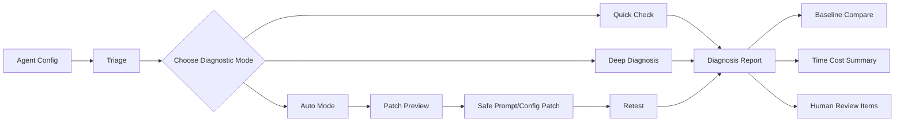

# AgentDoctor Documentation

AgentDoctor is a lightweight diagnostic toolkit for LLM agents. It is designed around a diagnostic workflow rather than a single eval result: inspect the agent, choose the right diagnostic mode, collect traces and findings, classify failures, compare against a baseline, review patch proposals, and watch runtime cost.

The current Python distribution is `agenttracedoctor`, the source package is `contract2agent`, and the installed CLI commands are `agentdoctor` and `c2a`. The documentation uses `agentdoctor`; `c2a` remains a compatibility alias for the original contract and trace commands.

## Diagnostic Philosophy

AgentDoctor treats an agent failure as evidence to investigate. A raw failure can say that `document_reader` was not called. A structured finding can say this is `TOOL_MISSING`, that the likely cause is an unclear prompt or workflow, and that the next review should inspect prompt/tool-description boundaries before applying a patch.

That distinction matters for safe repair. Patch preview, auto mode, baseline comparison, and human review all need structured failure classes rather than ungrouped test failures.

## Feature Overview

| Feature | Purpose | Primary command |
|---|---|---|
| Triage | Static intake before formal tests | `agentdoctor triage` |
| Quick Check | Single-round smoke diagnosis | `agentdoctor quick` |
| Deep Diagnosis | Multi-round detailed diagnosis | `agentdoctor deep --rounds 3` |
| Auto Mode | Limited safe diagnosis/repair loop | `agentdoctor auto --target-confidence 0.85` |
| Patch Preview | Preview-only patch proposal reports | `agentdoctor patch-preview --from-run reports/latest.json` |
| Baselines | Save and compare diagnostic state | `agentdoctor deep --rounds 3 --save-baseline` |
| Time Cost | Static cost estimate and measured run timing | `agentdoctor cost-estimate` |

## Workflow

## Recommended Workflow

1. Run [Triage](triage.md) to understand the agent, available files, risk level, and recommended test strategy.
2. Run [Quick Check](quick.md) for a fast smoke diagnosis over key behaviors.
3. Run [Deep Diagnosis](deep.md) for multi-round detailed diagnosis, traces, and review-policy handling.
4. Review [Failure Taxonomy](failure-taxonomy.md), findings, and human review items before deciding what to change.
5. Save or compare [Baselines](baselines.md) when checking regressions.
6. Use [Patch Preview](patch-preview.md) before modifying prompt or config files.
7. Use [Auto Mode](auto.md) only when safe patch boundaries, review policy, and stopping conditions are clear.
8. Check [Time Cost](time-cost.md) reports and estimates to avoid inefficient long runs.

## Documentation Map

| Page | Start here when... |
|---|---|
| [Getting Started](getting-started.md) | You need installation and first-run commands. |
| [CLI Reference](cli.md) | You need exact implemented commands and flags. |
| [Configuration](configuration.md) | You need supported config, prompt, tool, eval, and snapshot paths. |
| [Triage](triage.md) | You need pre-diagnosis planning and risk logic. |
| [Quick Check](quick.md) | You need a fast single-round development check. |
| [Deep Diagnosis](deep.md) | You need multi-round trace-aware diagnosis. |
| [Auto Mode](auto.md) | You need bounded repair loops and warnings. |
| [Failure Taxonomy](failure-taxonomy.md) | You need the structured finding categories. |
| [Baselines](baselines.md) | You need regression comparison and config snapshots. |
| [Patch Preview](patch-preview.md) | You need diff review and patch safety rules. |
| [Time Cost](time-cost.md) | You need runtime, estimate, and efficiency guidance. |
| [Reports](reports.md) | You need report paths and report structure. |
| [Examples](examples.md) | You want sample agents and sample reports. |
| [Development](development.md) | You need test, docs, and GitHub Pages setup. |
| [2026-05-04 Bug Audit](audits/2026-05-04-bug-audit.md) | You need the repository hardening audit notes. |
